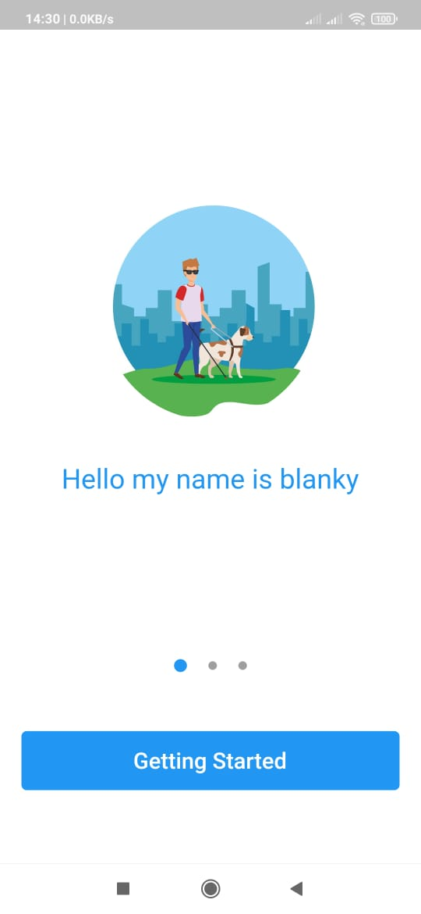
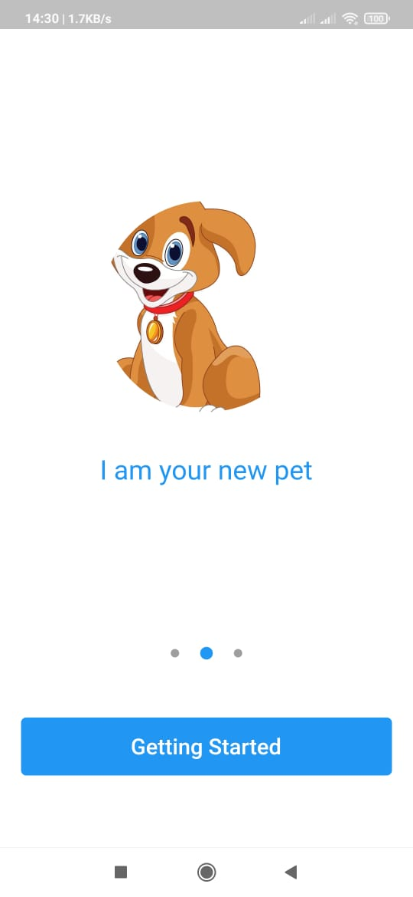
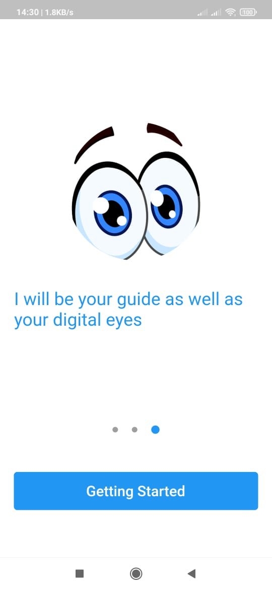
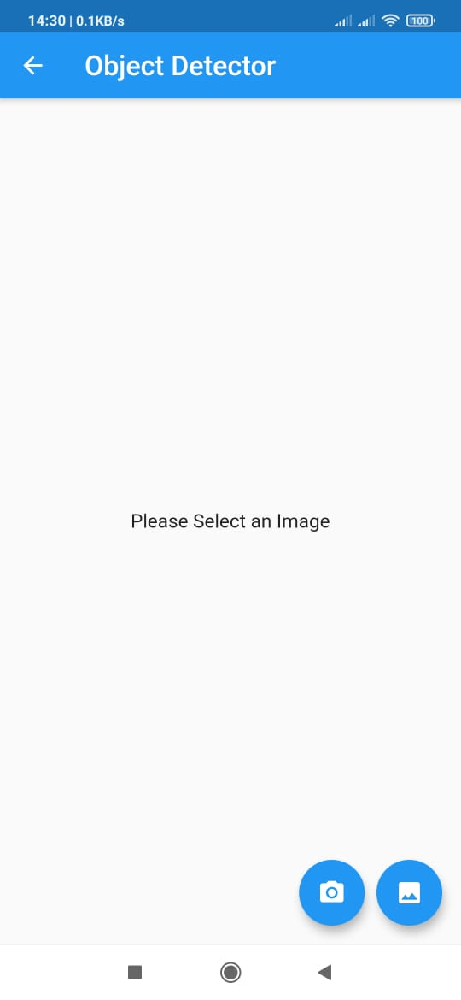

# Digital Eye
#### *Object Detection App*

## Table Of Contents
  - [About](#about)
  - [Installation Prerequisites](#installation-prerequisites)
  - [How to Run this Flutter App](#how-to-run-this-flutter-app)

## App Demo
- [Click Here to Watch App Presentation](https://docs.google.com/presentation/d/1-qcr59SNWyXHpy0Z3sxRwg-KXZ9oB02NXuB12Y_2RbY/edit?usp=sharing)

## About
This app is for all blind people. It will help them to detect object in front of them. For that our app Digital Eye will provide a helpper dog name's Blanky .
This pet will introduce the app to the user and will guide them. The App has following functionalities:

- The virtual Dog will guide the user.
- User can detect object in front of them by just one click.

## App Download
> You can download App-apk frome here [Download APK](https://drive.google.com/file/d/1vmOv7OzjDYYY0GI_tfE0CqbHVtdAcmsf/view?usp=sharing)

## Installation Prerequisites
- Flutter

>To Download Flutter SDK [Go to the Flutter Download Website](https://flutter.dev/docs/get-started/install).

- Packages
  
>To Download Flutter_svg  [Go to the Pub Dev Download Website](https://pub.dev/packages/flutter_svg)

>To Download Splashscreen  [Go to the Pub Dev Download Website](https://pub.dev/packages/splashscreen)

## How to Run this Flutter App
1. Clone this Repo to your Local Machine.
2.  Open The Terminal/CMD in the folder Digital Eye.
3.  Type flutter doctor to check all requirements.
4. Type flutter run in your terminal to start app.
5. Choose AVD in AVD Manager.
6. Enjoy!!! :eye: :dog: :man:

## Images
Welcome Page|Start Page|Home Page
:---------------------------------:|:---------------------------------:|:---------------------------------:|
||
**Introduction Page**|**Virtual Dog Page**|**Object Detection Page**
||

## Contributors

- [Nitish Kumar](https://github.com/Nitish9711)

- [Manan Grover](https://github.com/manan-grover)

- [Dhruv Gupta](https://github.com/dhruvg029)

- [Rajat Kumar](https://github.com/Rajat10Kumar)
